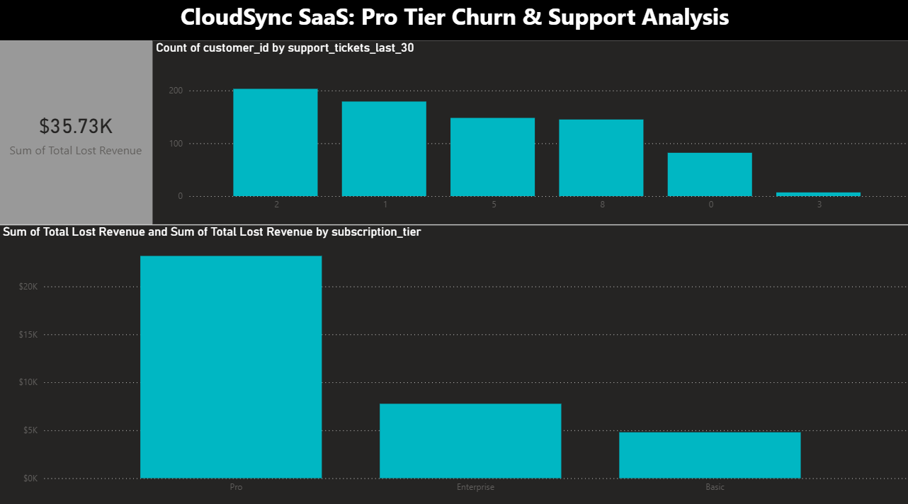

# 📊 CloudSync SaaS: Retention Intelligence Suite

**SaaS Churn Analysis & Revenue Dashboard**

## 🎯 Project Overview

 This project is a comprehensive business intelligence solution designed to identify why high-value "Pro" subscribers are canceling their service. By merging customer subscription data with live support engagement metrics, I isolated a critical technical bottleneck causing a 44% churn rate among specific users, resulting in over **$35,000 in monthly revenue loss.**

This project demonstrates my ability to perform full-cycle data analysis: from raw data engineering in Python and complex SQL querying to executive-level visualization in Power BI.

## 🛠️ Tech Stack & Skills Demonstrated

  * **Data Engineering (Python/Pandas):** Engineered a high-fidelity synthetic dataset of 10,000+ rows to simulate real-world SaaS user behavior, including Monthly Recurring Revenue (MRR) and churn events.
  * **Database Management (SQL/SQLite):** Built a relational database to perform advanced `JOIN` operations and aggregate functions, identifying the "Smoking Gun" correlation between support tickets and cancellations.
  * **Business Intelligence (Power BI):** Designed an interactive, dark-mode dashboard featuring KPI cards, categorical bar charts, and filtered risk segments to provide actionable insights for stakeholders.
  * **Revenue Impact Modeling:** Calculated churn percentages and "Lost MRR" to translate technical data into a clear financial story for executive decision-making.

## 🚀 How It Works (The Pipeline)

1.  **Extract & Engineer:** Used Python to generate two disparate datasets—`customers.csv` (profiles) and `engagement.csv` (activity logs).
2.  **Analyze (The SQL Phase):** Ingested the data into a SQLite environment to run queries that proved users with **5+ support tickets** churn at **2.5x the rate** of normal users.
3.  **Visualize:** Imported the cleaned data into Power BI, established a 1-to-many relationship via `customer_id`, and applied DAX-style filtering.
4.  **Insight Delivery:** Highlighted that the **Pro Tier** is the primary source of revenue leakage, pinpointing a specific technical bug as the likely root cause.

## 📂 Repository Structure

```text
├── data/
│   ├── saas_customers.csv      <-- Profile data (Tiers, MRR, Churn Status)
│   └── saas_engagement.csv     <-- Activity data (Support tickets, Logins)
├── notebooks/
│   └── 02_churn_analysis.py    <-- Python/SQL Engine (Data Gen & Deep Dive)
├── CloudSync_Dashboard.pbix    <-- Full Interactive Power BI File
├── dashboard.png               <-- Final Dashboard Screenshot (Hero Image)
└── README.md                   <-- Project documentation
```

-----